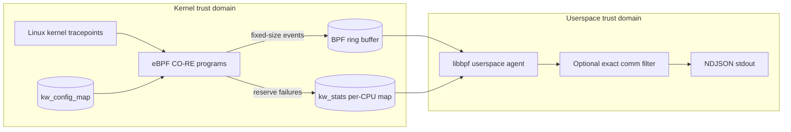

# Architecture

## System view

KernWatch deliberately separates kernel collection from userspace formatting. PID/UID filtering and open-event enablement happen before ring-buffer reservation in eBPF; the optional command-name filter runs after transport in userspace.

## Engineering invariants

| Concern | KernWatch behavior |
| --- | --- |
| Kernel portability | Builds `vmlinux.h` from host BTF and uses libbpf CO-RE relocations rather than a copied kernel source tree. |
| Hot-path allocation | Kernel events use fixed-size records and a bounded BPF ring buffer. |
| Filtering | PID/UID filters execute in-kernel before ring-buffer reservation; exact command filtering is userspace-only. |
| Semantic honesty | Syscall-entry events are observations, not claims that `execve`, `openat`, or `connect` succeeded. |
| Backpressure evidence | Failed ring-buffer reservations are counted per CPU and surfaced at shutdown instead of being silently ignored. |
| Runtime proof | CI includes a privileged load/attach smoke on Ubuntu 24.04, not only compilation. |
| Memory safety | Userspace code runs under ASan + UBSan in CI. |
| Static security analysis | C/C++ is analyzed with CodeQL `security-extended`. |
| Supply chain | Third-party GitHub Actions are pinned to reviewed immutable commit SHAs. |
| Licensing boundary | Userspace is Apache-2.0; the kernel eBPF program is GPL-2.0-only where GPL-restricted helpers require it. |

## Data path

KernWatch has two trust and execution domains.

1. **eBPF programs** attach to stable tracepoint names for `execve`, process exit, `openat`, and `connect`.
2. **libbpf userspace** loads and attaches the CO-RE object, configures maps, polls the ring buffer, applies the optional command filter, and serializes events as NDJSON.

The build produces `vmlinux.h` from `/sys/kernel/btf/vmlinux` and uses libbpf CO-RE relocations instead of compiling against a copied kernel source tree.

## Maps

### `kw_config_map`

A one-entry array map contains the runtime PID/UID filter configuration and the open-event capture toggle. PID and UID checks happen before a ring-buffer reservation.

### `kw_events`

A bounded BPF ring buffer transfers fixed-size `kw_event` records. Kernel code never allocates variable-sized event records.

### `kw_stats`

A per-CPU one-entry array records ring-buffer reservation failures. Per-CPU storage avoids contended atomic updates in the hot path. Userspace sums the counters at shutdown.

## Event semantics

The event schema intentionally distinguishes observation from outcome:

- `exec` is emitted at `sys_enter_execve`; it does not prove the image was successfully executed.
- `open` is emitted at `sys_enter_openat`; it does not prove the file was opened.
- `connect` is emitted at `sys_enter_connect`; it does not prove a connection was established.
- `exit` is emitted at `sched_process_exit`, without a fabricated status or termination reason.

The v0.1 envelope carries PID/TID and UID/GID but does not claim parent-process metadata. Future milestones can add richer process relationships and pair syscall entry/exit events when outcome semantics are needed.

## Runtime verification

Compilation is not enough for eBPF. The privileged runtime smoke job builds the CO-RE object and skeleton, loads and attaches the programs on an Ubuntu 24.04 hosted VM, triggers a process execution and localhost TCP connection, validates schema-1 NDJSON, then verifies graceful SIGTERM shutdown and drop accounting.

That runtime test exposed a real verifier/licensing incompatibility during development: tracing helpers such as user-memory probe reads require a GPL-compatible BPF program declaration. KernWatch therefore keeps the userspace under Apache-2.0 while the kernel BPF source is GPL-2.0-only.

## Failure model

A full ring buffer can cause event loss. KernWatch counts failed reservations, but it cannot reconstruct dropped events.

If the kernel rejects the BPF object because of missing features, verifier constraints, lockdown, LSM policy, or insufficient privilege, the userspace loader fails closed and exits. It never silently falls back to `/proc` polling.

## Portability

CO-RE reduces kernel-structure coupling. It does not guarantee support for every distribution or security policy. The first milestone has measured build and runtime evidence on x86_64 Ubuntu 24.04; arm64 build mapping exists but is not advertised as runtime-verified until corresponding evidence exists.

## Licensing boundary

Repository code is Apache-2.0 unless a file says otherwise. `bpf/kernwatch.bpf.c` is explicitly GPL-2.0-only so the loaded BPF object can legally and technically use kernel helpers marked GPL-only. The separate license text is stored under `LICENSES/`.